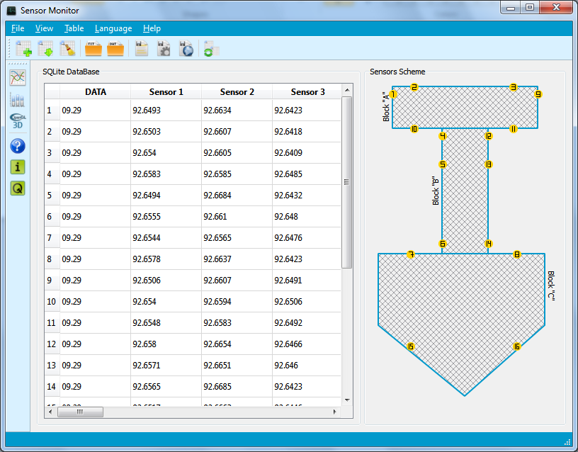
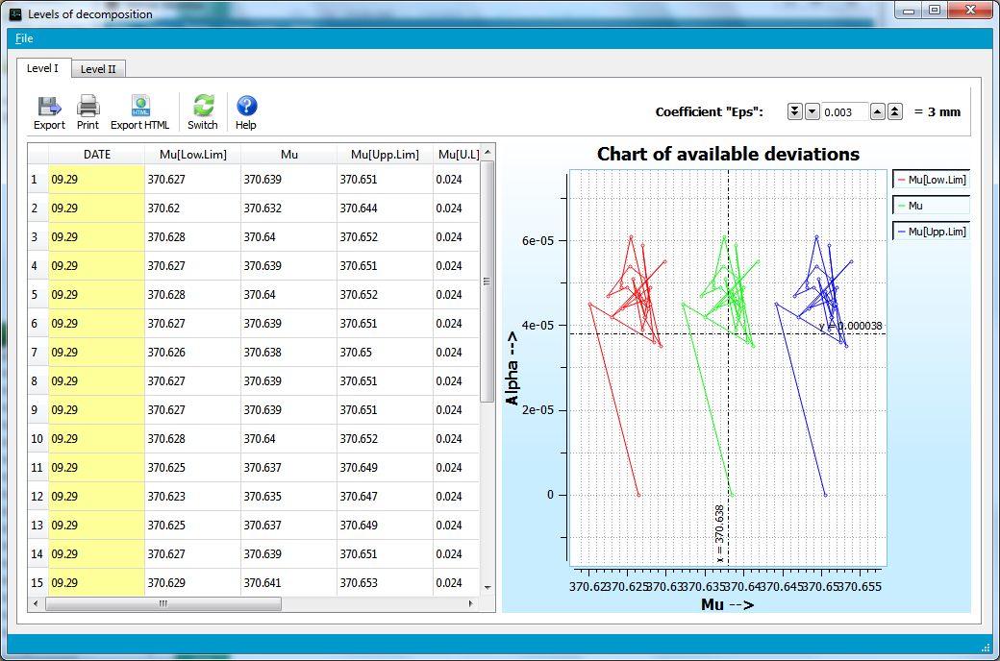
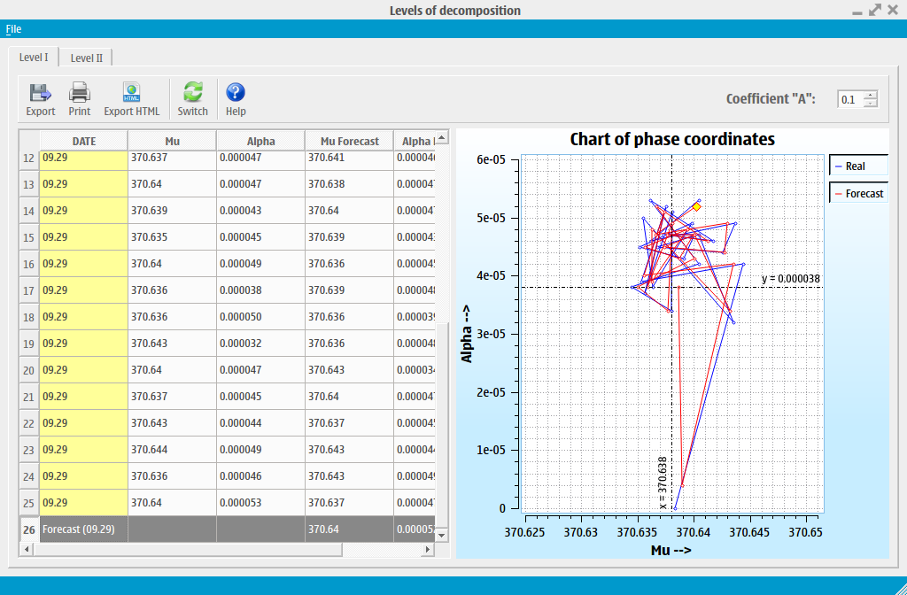

Sensor Monitor
=============

Sensor Monitor is program for monitoring readings from sensors.

## Building:
1. Compile [qwt-6.0.2.tar.bz2](http://sourceforge.net/projects/qwt/files/qwt/6.0.2/qwt-6.0.2.tar.bz2/download "qwt-6.0.2.tar.bz2") for your platform;
2. Update "QWT_PATH" variable in "SensorMonitor.pro";
3. Build SensorMonitor;
4. Move "doc/" folder of project directory to the project catalog.

## Interface
### MS Windows:

### GNU/Linux:

